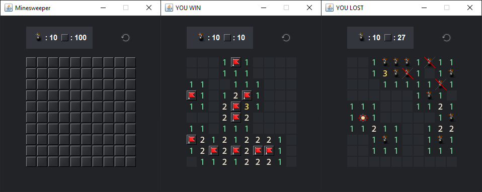

# Minesweeper
Simple minesweeper written in java



You can download and try minesweeper from [jar file](assets/minesweeper.jar)
<br>
You can change dimensions and number of bombs in Game class:
```
ROWS
COLUMNS
NUMBER_OF_MINES
```
### To do list:
- [x] Basic minesweeper game finished :tada:
- [ ] Create settings screen to change number of rows, columns and bombs 
